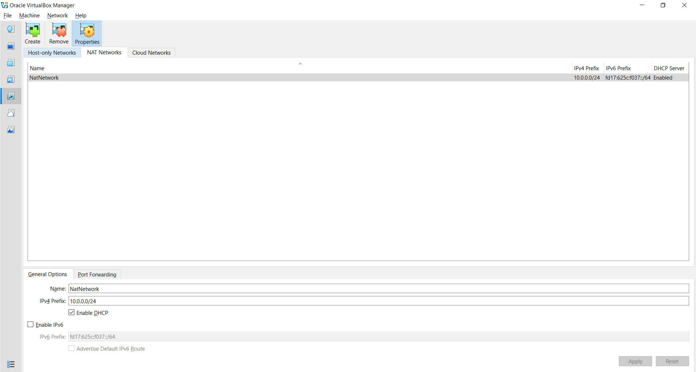
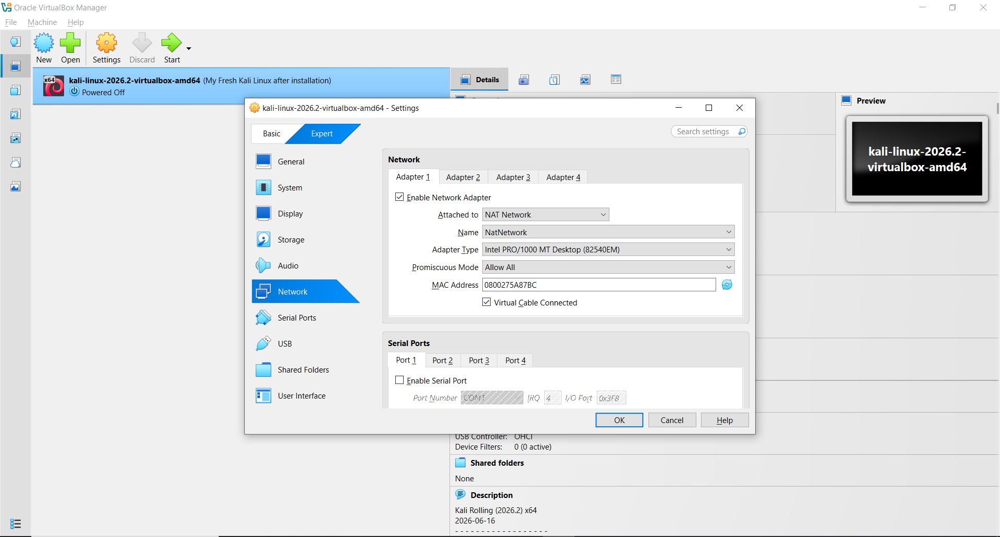
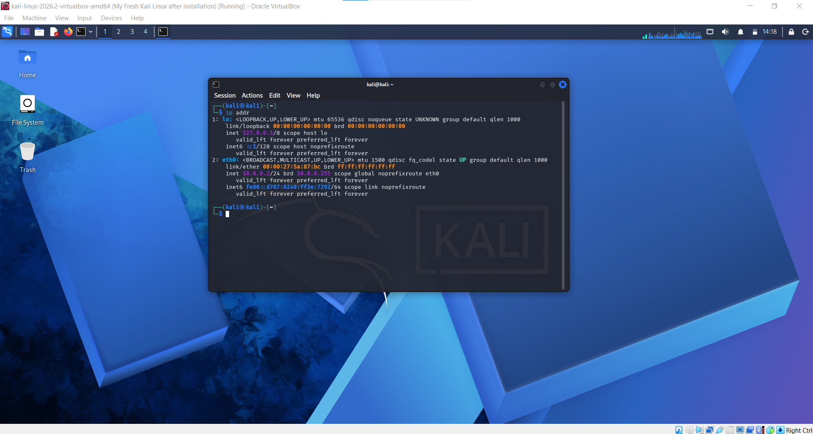
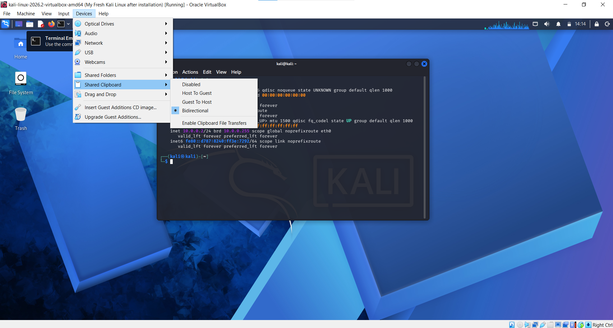
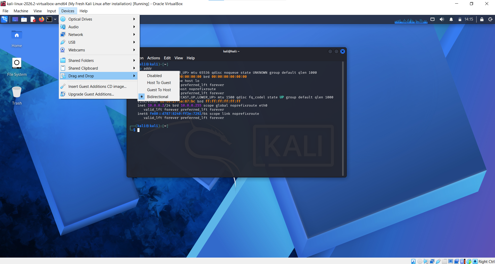
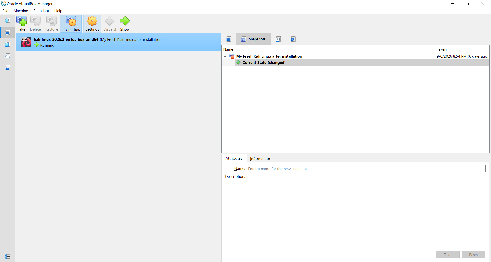
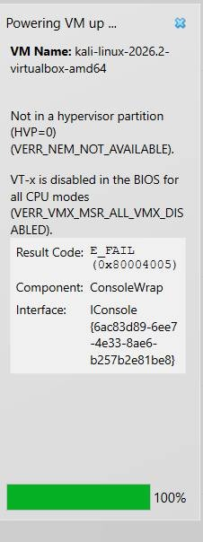

# Cybersecurity Lab Environment Setup

Building a virtual cybersecurity lab using VirtualBox and Kali Linux for cybersecurity and ethical hacking practice.

## Project Overview

This project focuses on setting up a virtual cybersecurity and penetration-testing environment using Oracle VirtualBox and Kali Linux.

The purpose of this lab is to create a controlled environment where cybersecurity tools, networking concepts, reconnaissance, vulnerability assessment, and other security-testing activities can be practiced safely.

The lab is configured using a custom NAT Network with the `10.0.0.0/24` subnet. Kali Linux is configured as the primary cybersecurity testing machine with a static IP address of `10.0.0.2/24`.

This project was completed as part of the NetworkWalks Cybersecurity Internship - Week 1 Project Module 1 (WK1-PM1).

---

## Project Information

| Item | Details |
|---|---|
| Program | NetworkWalks Cybersecurity Internship |
| Week / Module | Week 01 - Project Module 01 |
| Project | Cybersecurity Lab Environment Setup |
| Hypervisor | Oracle VirtualBox |
| Guest OS | Kali Linux |
| Network Type | NAT Network |
| Network | `10.0.0.0/24` |
| Kali IP | `10.0.0.2/24` |
| Gateway | `10.0.0.1` |

---

## Lab Objectives

The main objectives of this project were:

- Install and configure Oracle VirtualBox
- Set up Kali Linux as a cybersecurity testing machine
- Create a custom NAT Network
- Configure the network using the `10.0.0.0/24` subnet
- Assign Kali Linux the IP address `10.0.0.2/24`
- Configure Internet connectivity
- Enable Shared Clipboard
- Enable Drag and Drop
- Configure a shared folder between the host and Kali Linux
- Take a snapshot of the working Kali Linux virtual machine

---

## My Setup

### Host Machine

| Component | Details |
|---|---|
| Host OS | Windows |
| Processor | Intel(R) Core (TM) i7-4600U CPU @ 2.10GHz |
| RAM | 8.00 GB |
| Storage | 256GB |
| VirtualBox Version | 7.2.16 |

### Virtual Machine

| Component | Details |
|---|---|
| Guest OS | Kali Linux |
| Architecture | 64-bit |
| Network | Custom NAT Network |
| IP Address | `10.0.0.2/24` |
| Gateway | `10.0.0.1` |

---

# Lab Architecture

```text
                    Host Computer
                         |
                     VirtualBox
                         |
                  Custom NAT Network
                     10.0.0.0/24
                         |
                    Kali Linux
                  10.0.0.2/24
                         |
                    Internet
````

Kali Linux is used as the cybersecurity testing machine within the virtual lab environment.

---

# Setup Steps

## Step 1 - Install VirtualBox

Oracle VirtualBox was installed on the host machine.

VirtualBox is used as the virtualization platform for running Kali Linux as a virtual machine.

---

## Step 2 - Download Kali Linux

The Kali Linux VirtualBox image was downloaded and imported into Oracle VirtualBox.

Kali Linux will be used as the main cybersecurity and ethical hacking practice machine.

---

## Step 3 - Create the NAT Network

A custom NAT Network was created in VirtualBox.

The network was configured with:

```text
Network: 10.0.0.0/24
```

The NAT Network allows the virtual machine to communicate through the configured virtual network while maintaining Internet connectivity.

### Screenshot



---

## Step 4 - Configure Kali Linux Network Adapter

The Kali Linux virtual machine was configured to use the custom NAT Network.

The network adapter was attached to the newly created NAT Network.

### Screenshot



---

## Step 5 - Configure Kali Linux IP Address

The Kali Linux network interface was configured with the required static IP address.

```text
IP Address: 10.0.0.2/24
Gateway:    10.0.0.1
```

The IP configuration was then verified from the Kali Linux terminal.

Example command:

```bash
ip addr
```

### Screenshot



---

## Step 6 - Enable Shared Clipboard and Drag & Drop

VirtualBox settings were configured to allow communication between the host machine and Kali Linux.

The following options were enabled:

```text
Shared Clipboard: Bidirectional
Drag and Drop:    Bidirectional
```

This makes it easier to transfer text and files between the host machine and the virtual machine during lab activities.

### Screenshot





---

## Step 7 - Test Internet Connectivity

After configuring the network, Internet connectivity was tested from Kali Linux.

The connection can be tested using:

```bash
ping -c 4 google.com
```
Initially, Kali Linux was not able to access the Internet even though the NAT Network and IP configuration had been set up correctly.

I troubleshot the issue using the commands provided in the NetworkWalks lab guide.

After applying the fix and restarting the network connection, Internet connectivity was restored successfully.

A successful response confirms that Kali Linux can access the Internet.

### Screenshot


---

## Step 8 - Take a Snapshot

After completing the configuration and testing the environment, a snapshot of the working Kali Linux virtual machine was created.

The snapshot provides a clean restore point that can be used before performing future cybersecurity exercises.

### Screenshot



---

# Troubleshooting

## 1. Virtualization / VT-x Error

During the initial setup, I encountered an error when trying to start the Kali Linux virtual machine.

The error displayed:

```text
Not in a hypervisor partition (HVP=0)
(VERR_NEM_NOT_AVAILABLE)

VT-x is disabled in the BIOS for all CPU modes
(VERR_VMX_MSR_ALL_VMX_DISABLED)

Result Code: E_FAIL (0x80004005)
```

### Screenshot of the Error



The error indicated that hardware virtualization was disabled on the system.

### Solution

I restarted the laptop and entered the BIOS/UEFI settings.

The hardware virtualization option was enabled and the changes were saved.

After restarting Windows, I opened VirtualBox and started the Kali Linux virtual machine again.

The Kali Linux VM successfully started after enabling virtualization.

### What I Learned From This Issue

This issue helped me understand that VirtualBox requires hardware virtualization support to run 64-bit virtual machines properly.

I also learned that errors such as:

```text
VERR_NEM_NOT_AVAILABLE
VERR_VMX_MSR_ALL_VMX_DISABLED
```

can indicate a problem with the system's virtualization configuration.

---

## 2. Kali Linux Internet Connectivity Issue

### 2. Kali Linux Internet Connectivity Issue

After configuring the Kali Linux network, I encountered an Internet connectivity issue. This is a known issue mentioned in the lab guide for VirtualBox 7 and newer Kali Linux versions.

The NAT Network and IP configuration were already configured, but Kali Linux was still unable to access the Internet.

The following commands were used:

```bash
sudo nmcli connection modify "Wired connection 1" ipv4.dad-timeout 0
sudo nmcli connection down "Wired connection 1"
sudo nmcli connection up "Wired connection 1"
```
After running the commands, I tested the Internet connection again:

```bash
ping -c 4 google.com
```
The Internet connection was restored successfully.

### What I Learned From This Issue

This issue helped me understand that having the correct IP address and VirtualBox network configuration does not always guarantee Internet connectivity.

I also learned how to use nmcli to modify and restart a NetworkManager connection in Kali Linux.

# Verification

After completing the setup, the following configuration was verified:

```text
VirtualBox             ✓
Kali Linux             ✓
NAT Network             ✓
Network: 10.0.0.0/24   ✓
Kali IP: 10.0.0.2/24   ✓
Internet Access         ✓
Shared Clipboard        ✓
Drag and Drop           ✓
Shared Folder           ✓
VM Snapshot             ✓
```

---

# What I Learned

This project helped me understand the basics of creating a virtual cybersecurity lab.

Some of the key things I learned were:

### 1. Virtualization

I learned how virtualization allows a separate operating system such as Kali Linux to run inside my main operating system without requiring a separate physical machine.

### 2. VirtualBox Networking

I learned how to create and configure a custom NAT Network and connect a virtual machine to it.

### 3. IP Configuration

I learned how to configure a static IP address and understand the relationship between an IP address, subnet, and gateway.

### 4. Kali Linux

I gained practical experience setting up Kali Linux as a cybersecurity testing environment.

### 5. Troubleshooting

The virtualization error during the setup gave me practical troubleshooting experience. I learned how BIOS/UEFI virtualization settings can affect the operation of virtual machines.

### 6. Snapshots

I learned how VirtualBox snapshots can be used to create a restore point before performing future experiments.

---

# Skills Practiced

* Virtualization
* Oracle VirtualBox
* Kali Linux
* Basic Networking
* IP Addressing
* NAT Networks
* Linux
* Troubleshooting
* Cybersecurity Lab Setup

---

# Ethical Use

This lab is intended for educational purposes and authorized cybersecurity testing only.

All security testing performed using this environment should be limited to systems that I own or have explicit permission to test.

---

# Project Resources

* Oracle VirtualBox
* Kali Linux
* NetworkWalks Cybersecurity Training

---

## Author

Maida Shafaq

Cybersecurity Intern

NetworkWalks Cybersecurity Internship

---

Created as part of NetworkWalks Cybersecurity Training - WK1-PM1.

````
